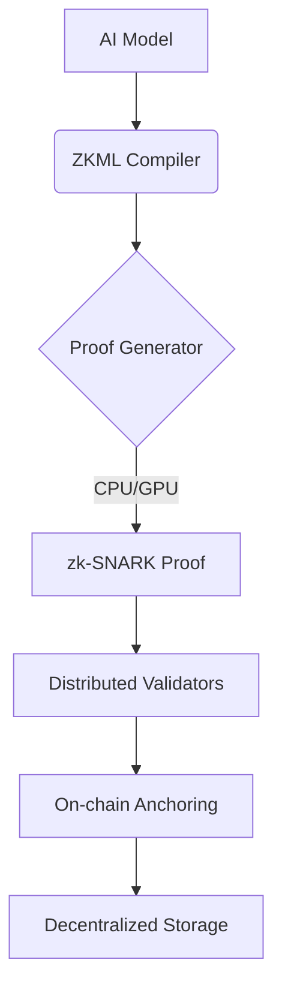

# Velonk Protocol 

**Decentralized AI Verification Network** powered by Zero-Knowledge Machine Learning

## 🌟 Key Features
- 🚀 Sub-second ZKML proof verification (avg. 800ms)
- 🔗 Cross-chain compatible verification contracts
- 🔒 TEE-Enhanced model confidentiality
- ⚡ Hardware-accelerated proof generation
- 🌐 Distributed light node network (3000+ nodes)

## 🛠️ Technical Architecture

## Core Components

### 1. ZKML Verification Protocol
- Compiles AI models into zk-SNARK circuits
- Supports PyTorch/TensorFlow/ONNX

### 2. Distributed Validation Network
- BLS-12-381 signature aggregation
- Geo-distributed light nodes

### 3. Hardware Acceleration Layer
- CUDA optimizations for NVIDIA GPUs
- SGX enclaves for sensitive operations

## ⚡ Quick Start

### Prerequisites
- Python 3.10+
- Rust 1.68+ (for zk components)
- NVIDIA CUDA Toolkit 12.0 (optional)

## 📂 Repository Structure
velonk-core/
├── circuits/           # ZKML circuit definitions
├── contracts/          # Smart contracts (Solidity)
├── nodes/              # Light node implementation
├── sdk/                # Python SDK
│   ├── cli.py          # Command-line interface
│   └── verifier.py     # Core verification logic
├── tests/              # Test suites
└── docs/               # Technical documentation

## 🤝 Contributing
### Development Workflow
 1. Fork repository
 2. Create feature branch

### Code Standards
- Python: PEP8 with type annotations
- Rust: 2021 edition with clippy checks
- Solidity: 0.8.x with Slither security patterns
